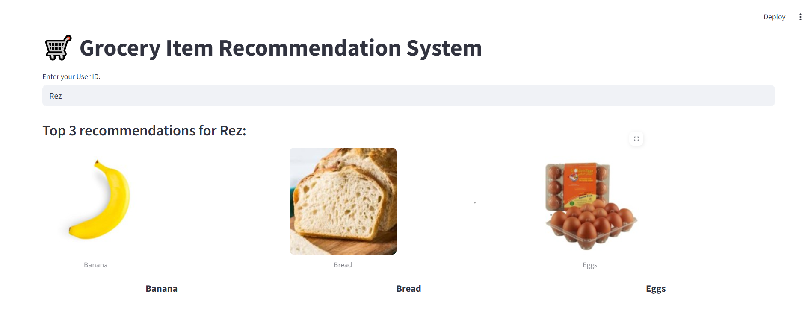

# Grocery Item Recommendation System

This project is a simple **Grocery Item Recommendation System** built using **Python** and **Streamlit**. The system provides personalized grocery recommendations based on user preferences using a collaborative filtering technique. It uses item-item cosine similarity to suggest products similar to the ones the user has liked.

---

## Features
- Personalized grocery item recommendations for users.
- Visual grid layout displaying the recommended items with images, names, prices, and categories.
- Built with **Streamlit** for a clean and interactive user interface.
- Uses **Pandas** for data manipulation and **scikit-learn** for the similarity calculations.

---

## Technologies Used
- **Python** (3.x)
- **Streamlit**: Framework for building the web interface.
- **Pandas**: Data manipulation library for creating the user-item matrix.
- **scikit-learn**: Machine learning library used for cosine similarity calculation.

---

## Getting Started

Follow these steps to get your project running locally:

### Prerequisites

Make sure you have the following installed:
- Python (>= 3.7)
- pip (Python package manager)

### Installation

1. Clone this repository to your local machine:
    ```bash
    git clone https://github.com/your-username/grocery-recommender.git
    cd grocery-recommender
    ```

2. Create a virtual environment (optional but recommended):
    ```bash
    python -m venv venv
    ```

3. Activate the virtual environment:
    - **Windows**: `.\venv\Scripts\activate`
    - **Mac/Linux**: `source venv/bin/activate`

4. Install the necessary dependencies:
    ```bash
    pip install -r requirements.txt
    ```

    If you don't have the `requirements.txt` file, you can manually install the required libraries:
    ```bash
    pip install streamlit pandas scikit-learn
    ```

---

## How to Run

1. Make sure you're in the project directory and that the required files (`purchases.csv` and `items.csv`) are in the same folder as `app1.py`.

2. Start the Streamlit app:
    ```bash
    streamlit run app1.py
    ```

3. Open the provided URL in your browser to interact with the app. It will be something like `http://localhost:8501`.

---

## How It Works

1. **Data Files**:
    - `purchases.csv`: Contains user-item interactions and ratings.
    - `items.csv`: Contains item details such as item name, image path, price, and category.

2. **User Input**:
    - The user enters their `User ID` to get personalized grocery item recommendations.
  
3. **Recommendation Algorithm**:
    - The system uses collaborative filtering, calculating item-item cosine similarity based on users' ratings of items.
    - The recommended items are displayed with images, names, prices, and categories.

---


---

## Sample Interface

Here’s a screenshot showing the user interface of the app:



---

## Contributing

Feel free to fork this repository and contribute to it. If you'd like to add new features or report bugs, please submit a pull request or create an issue.

---

## License

This project is open source and available under the [MIT License](LICENSE).


